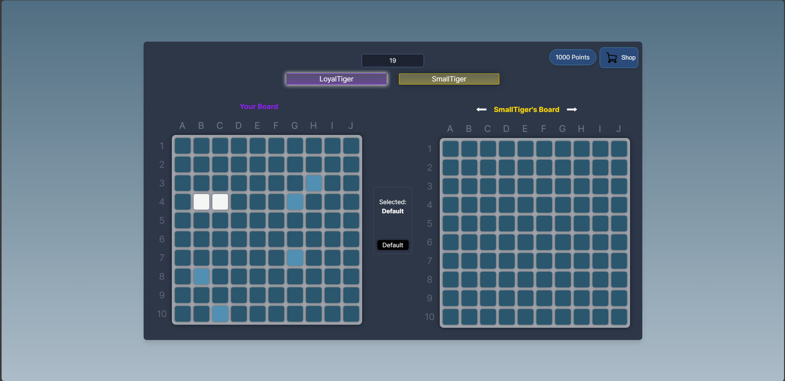
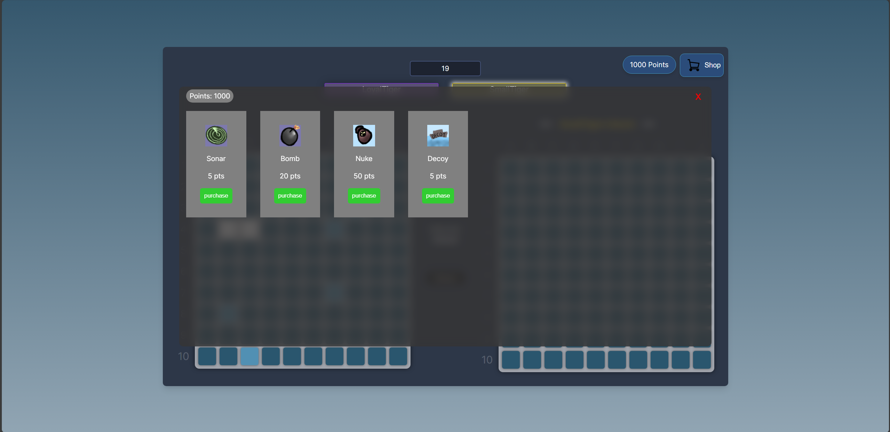

# Battleship Legends
A multiplayer online battleship game where 4 players can join a room and play against each other. The game is built using javascript/typescript and react for the front end and Spring Boot for the backend.

# Features
- Multiplayer support for 4 players
- Real-time updates using WebSockets
- Real-time chat functionality in the lobby
- Power ups to enhance gameplay

# Getting started
## Prerequisites
- [Node.js](https://nodejs.org/en/download)
- [Java 21](https://www.oracle.com/java/technologies/javase/jdk21-archive-downloads.html)
- [Maven](https://maven.apache.org/download.cgi)

## Frontend
1. Go to `client` directory
2. Run `npm install` to install dependencies
3. Run `npm run dev` to start the development server
4. Open `http://localhost:...` in your browser

## Backend
1. Go to `server` directory
2. Run `mvn clean install` to build the project
3. Run `mvn spring-boot:run` to start the backend server

# Screenshots

